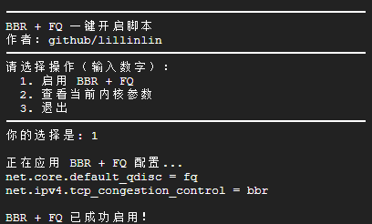

一键开启BBR+FQ //oneclick-bbr-fq
并且采用写入/etc/sysctl.conf的方式 / And write to /etc/sysctl.conf  


install  
```bash
bash <(wget -qO- https://raw.githubusercontent.com/lillinlin/oneclick-bbr-fq/main/install.sh)
```


  

